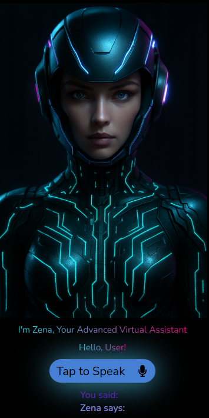
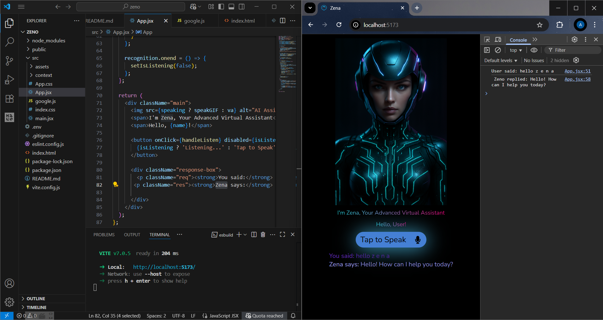

# 🤖 Zena – AI Virtual Assistant Web App

Zena is an interactive voice-enabled virtual assistant built using **React.js**, **Vite**, and the **Web Speech API**.  
It can listen to your voice, transcribe speech in real-time, and respond back with a smart, animated interface.

---

## 🔮 Features

- 🎤 **Voice Recognition** – Converts spoken words into text using the Web Speech API.
- 🧠 **Smart Replies** – Responds dynamically to specific voice inputs like “Hello Zena”.
- 🖼️ **Animated UI** – Avatar animation changes when speaking/listening.
- ⚡ **Fast & Modern UI** – Built with React + Vite for a blazing-fast experience.
- 🌗 **Dark Theme** – Sleek and futuristic design.

---

## 🛠 Tech Stack

- **Frontend:** React.js, Vite, JavaScript, CSS
- **Voice Recognition:** Web Speech API
- **Design Tools:** HTML5, CSS3, AI-generated avatar

---

## 📦 Required NPM Packages
npm create vite@latest zena --template react
cd zena
npm install
npm install react-icons

# 📁 Project Structure
zeno/
├── node_modules/
├── public/
│   └── vite.svg
├── src/
│   ├── assets/
│   │   ├── ai.png
│   │   ├── logo.png
│   │   ├── speak.gif
│   │    
│   ├── context/
│   │   └── UserContext.jsx
│   ├── App.css
│   ├── App.jsx
│   ├── google.js
│   ├── index.css
│   └── main.jsx
├── .env
├── .gitignore
├── eslint.config.js
├── index.html
├── package-lock.json
├── package.json
├── README.md
├── vite.config.js

🔄 Optional (but useful):

npm install react-speech-recognition

# final out put

